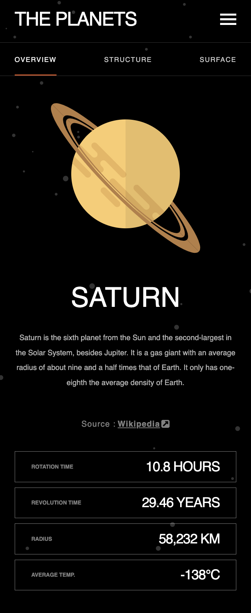
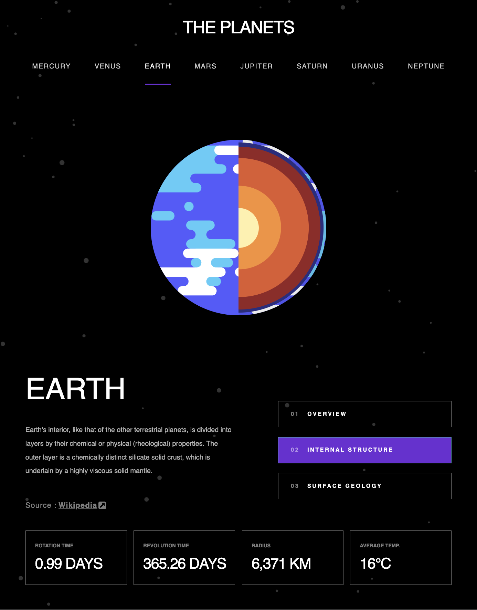
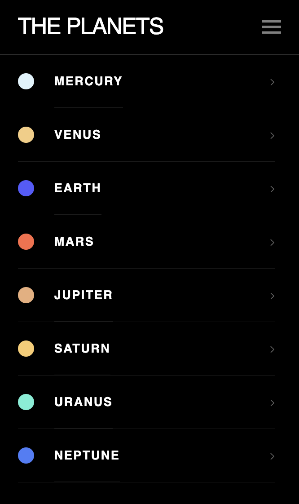

# Frontend Mentor - The Planet Explorer App

This app is my approach to the Frontend Mentor challenge consisting in a responsive website that displays infromation and images of the Solor System's planets in three different screen sizes: mobile, tablet, and desktop.

In the mobile version the user can browse through the planet's subpages comprising information about its overview (default page), structure and surface. It is also possible to choose another planet by clicking on the hamburger icon on the right side of the top bar.

The tablet and desktop versions contain a menu bar at the top with a link to each planet page. There is also a menu on the right side of the main section, where the user can access the overview, internal structure and surface geology subpages.

All pages and subpages contain a footer with information boxes that summarize the planet's essential data: rotation and revolution times, radius and average temperature.

# [Planet Explorer](https://planet-explorer.vercel.app/)

### Statically generating a Planet Explorer website with `Next.js`, `Contentful`, and `CSS modules`

## The Challenge and Learning Goals

### The present project consists in:

- implementing a Figma design pretty close to pixel-precision with CSS Modules
- using Next.js to statically generate pages and subpages, specially by using the `getStaticPaths` and `getStaticProps` functions
- creating reusable components (atoms, molecules, and organisms) with the goal of properly setting their scopes and complexity, and assemble them to result in beautiful design and functionality, allowing the application to grow in a concise, smart way
- making use of a Content System Management (Contentful) where the data is fetched from, and can be edited by fellow workers without the need of programming skills
- adding metadata via [next/head](https://nextjs.org/docs/api-reference/next/head) and [Open Graph Protocol](https://ogp.me/), so that the content of the website can be efficiently fathomed by search engines and shareable via social media (generating cards for each page/subpage)
- deploying the application using Vercel and setting up the corresponding webhooks

### What did we achieve

- by applying the concept of static generation, every planet page and subpage is an individual page, resulting in optimized content indexation by search engines
- at the same time, the user experiences an integrated application, since the layout and content may give the impression of being browsing on the same page (for example: in the mobile screen, the "overview, "structure" and "surface" subpages can be accessed by clicking on each of the corresponding links. Only the image and description content change, while the top bar and footer tabs remain the same)
- the choice to generate pages statically seems to be in good proportion to the amount/nature of the data needed, resulting in a very quick transition from one page to another
- a beautiful layout and styling patterns, for example: each planet has a color theme that refers to its image and is reflected in the underscore bar of the selected subpage(mobile version) or planet(tablet/desktop versions) in the correspondent menu, and the tab background color of the selected subpage (tablet/desktop screens)
- the use of local state is only for the mobile version to switch between a planet page and the planets menu. Even this state could be removed eg. via a hidden checkbox!
  For the purposes of this website, it means simplicity, therefore without unnecessary complications
- thanks to data fetching via CMS, the app allows professionals without coding skills to collaborate to change and update its content
- each page and subpage generates a card with image and summary information, making it easy and cool to share via social media

### Design preview: Planet Overview - Mobile Version



### Design preview: Planet Internal Structure - Tablet Version



### Design preview: Planets Menu - Mobile Version



### Built with

- [Next.js](https://nextjs.org/)
- [React](https://reactjs.org/), [React-dom](https://reactjs.org/docs/react-dom.html)
- [Contentful](https://www.contentful.com/)
- [CSS modules](https://github.com/css-modules/css-modules)
- [CSS styling](https://developer.mozilla.org/en-US/docs/Web/CSS), and [flexbox](https://css-tricks.com/snippets/css/a-guide-to-flexbox/)

### Concepts and techniques applied

- Next.js: `getStaticPaths()` & `getStaticProps()` functions, and `next/head` tag
- Contentful: generating models & entries, and using `createClient()` and `client.getEntries()` in the projects code
- React: reusable components, useState, callback props
- CSS modules, and flexbox

### How to use this Repo

- create a local folder and inside it type the following command: `git clone git@github.com:luizfiorentino/static-generation-planets-navigator.git`
- install dependencies with `npm install`
- open another terminal screen to run the app: `npm run start` or `npm run dev` (developers mode)

### Conclusion

Try the different screen versions (mobile, tablet, desktop) by expanding/shrinking your browser's screen, and enjoy the responsive design bringing interesting information about the planets of the Solar System!

<!-- ---

- use screen shots to illustrate

::Planet Explorer

- static generation (getStaticProps, getStaticPaths) -> mention some advantages
- NextJS -> mention advantages of it instead using CRA
- reusable components (atoms, molecules, organisms) and complexity
- css modules
- CMS contentful
- deployment + webhooks
- Figma design
- responsive design (use onHover in the subpages tabs!) + different screen versions (m, t, d)
- html minimum use of useState
- styles -> landing strip (to be implemented)
- meta information card -> social media
- using callback props (give example) -->

<!-- This is a [Next.js](https://nextjs.org/) project bootstrapped with [`create-next-app`](https://github.com/vercel/next.js/tree/canary/packages/create-next-app).

## Getting Started

First, run the development server:

```bash
npm run dev
# or
yarn dev
# or
pnpm dev
```

Open [http://localhost:3000](http://localhost:3000) with your browser to see the result.

You can start editing the page by modifying `pages/index.js`. The page auto-updates as you edit the file.

[API routes](https://nextjs.org/docs/api-routes/introduction) can be accessed on [http://localhost:3000/api/hello](http://localhost:3000/api/hello). This endpoint can be edited in `pages/api/hello.js`.

The `pages/api` directory is mapped to `/api/*`. Files in this directory are treated as [API routes](https://nextjs.org/docs/api-routes/introduction) instead of React pages.

This project uses [`next/font`](https://nextjs.org/docs/basic-features/font-optimization) to automatically optimize and load Inter, a custom Google Font.

## Learn More

To learn more about Next.js, take a look at the following resources:

- [Next.js Documentation](https://nextjs.org/docs) - learn about Next.js features and API.
- [Learn Next.js](https://nextjs.org/learn) - an interactive Next.js tutorial.

You can check out [the Next.js GitHub repository](https://github.com/vercel/next.js/) - your feedback and contributions are welcome!

## Deploy on Vercel

The easiest way to deploy your Next.js app is to use the [Vercel Platform](https://vercel.com/new?utm_medium=default-template&filter=next.js&utm_source=create-next-app&utm_campaign=create-next-app-readme) from the creators of Next.js.

Check out our [Next.js deployment documentation](https://nextjs.org/docs/deployment) for more details. -->
